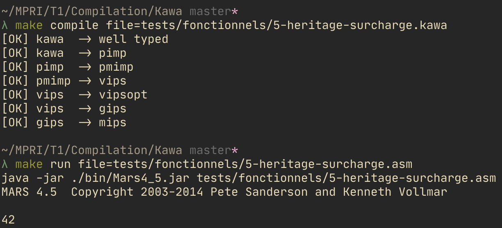
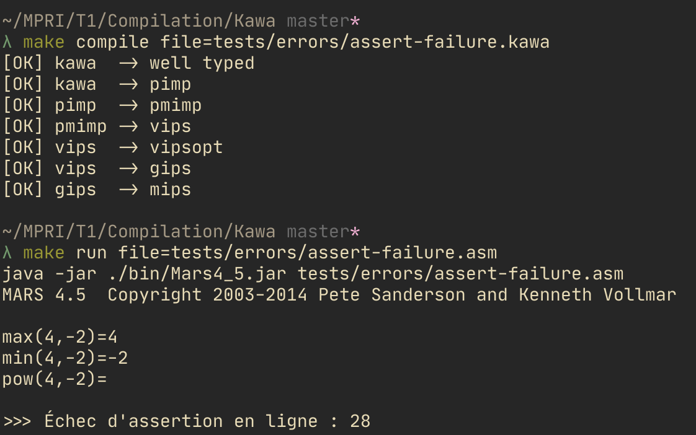
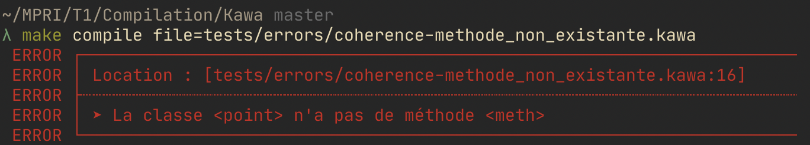

# Kawa

Compilateur optimisant du langage Kawa (langage objet type Java) vers l'assembleur MIPS.
Projet de M1@MPRI, dans le cadre du cours de compilation de [M.Balabonski](https://www.lri.fr/~blsk/).

## Dépendances

- [Dune](https://dune.build) : installation avec `opam install dune`
- [Menhir](http://gallium.inria.fr/~fpottier/menhir/) : installation avec `opam install menhir`

## Usage

+ Installation :
    ```bash
    $ git clone https://github.com/paulpatault/Kawa.git
    $ cd Kawa
    $ make
    ```
+ Exécution :
  + Pour commencer, compiler le fichier kawa :
    ```bash
    $ make compile file=<nom_du_fichier.kawa>
    ```
  + Puis éventuellement, exécuter directement en ligne de commande le fichier asm généré :
  (nécessite le fichier `Mars4_5.jar` dans le dossier `./bin`)
    ```bash
    $ make run file=<nom_du_fichier.asm>
    ```
+ Rangement:
    Suppression de l'exécutable et du dossier `_build`
    ```bash
    $ make clean
    ```
    Même chose que `make clean`, avec en plus une suppression des fichiers générés par une exécution
    ```bash
    $ make cleanall
    ```

## Organisation du code
Le projet est régit par une architecture `dune`.
Le code est contenu dans le dossier [`src/`](./src) et séparé en nombreux sous dossiers.
Vous retrouverez donc :
- [`ast/`](./src/ast) : contient l'ensemble des fichiers [`kawa.ml`](./src/ast/kawa.ml), [`pimp.ml`](./src/ast/pimp.ml), etc.
- [`kawadir/`](./src/kawadir) : contient le lexer, parser et type\_checker pour un fichier `.kawa`.
- [`optim/`](./src/optim) : contient les fichiers utiles pour le phase de compilation optimisée.
- [`printer/`](./src/printer) : contient les pretty-printers de chaque `ast`.
- [`trads/`](./src/trads) : contient les fichiers `<alpha>2<beta>.ml`, où `<alpha>` et `<beta>` sont deux
  langages internes de internes de notre compilateur.
- [`utils/`](./src/utils) : contient des fichiers implémentant un certain nombre de fonctions/exceptions/...
  utiles pour l'ensemble du projet.

## Organisation des tests
Les tests sont contenus dans le dossier [`tests/`](./tests) et séparé en deux sous dossiers.
Vous y retrouverez :
- [`fonctionnels/`](./tests/fonctionnels) : contient de nombreux fichiers d'exemple qui peuvent être compilés depuis
  le langage `kawa` vers l'assembleur `mips`.
- [`errors/`](./tests/errors) : contient différents fichiers donnant différents exemples d'erreurs.
  Aucun de ceux-ci ne passe à la compilation, le comportement attendu est le déclanchement
  d'une erreur.

## Travail réalisé
### Travail proposé
- Compilation des classes :
  - Les descripteurs sont enregistrés statiquement dans `.data`.
  - Les objets sont alloués dynamiquement sur le tas.
- Gestion de l'héritage :
  - héritage simple : s'il n'y a pas de redéfinitions, les nouvelles méthodes sont simplement ajoutés
  à la liste des méthodes de la classe mère.
  - extension des attributs et méthodes : les noms des attributs/méthodes sont "isolés" dans
  les tables de classes, ce qui rend possible d'utiliser les même noms dans des classes
  différentes sans que cela pose de problème.
  - surcharches des méthodes : les surcharges sont gérés dans le fichier [`kawa2pimp.ml`](./src/trads/kawa2pimp.ml)
  qui, avant d'analyser les classes, regardent si les classes hérités ont des méthodes communes
  avec leur parent. Si c'est le cas, le décalage sera le même pour celles-ci.
  - remarque : il est possible de faire plusieurs niveau d'héritage (cf. [`exemple.kawa`](./tests/fonctionnels/6-heritage-complexe.kawa))

- Vérification du typage avant la compilation :
  - Vous retrouverez l'appel à `Kawa.type_checker.typ_prog` dans le fichier "main" [`kawac.ml`](./src/kawac.ml).
  Cette procédure à pour fonction de vérifier le bon typage et la cohérence du programme `kawa`.
  Ainsi, si le programme est incohérent, une exception accompagnée d'un message d'erreur
  précis indiquant la cause de l'erreur ainsi que sa localisation dans le code.

### Modifications personnels
- Extensions de `putchar` :
  - Ajout de la possibilité d'imprimer des strings avec la procédure `putchar("Hello World !")`.
  - `putchar` peut prendre autant un grand nombre de paramètres, autant que l'on veut. C'est à dire
  que l'on peut faire par exemple `putchar("a=", a, ", b=", b)`.
- Extension de la syntaxe de Kawa :
  - Ajout des opérateurs :
    - comparaison arithmétiques : `<=`, `>`, `>=`, `!=`
    - connecteurs logiques : `&&` (et), `||` (ou), `!` (non)
  - Annotations dans le code : tags (à écrire juste avant une déclaration de méthode)
    - Syntaxe : `@{tag_name_1, …, tag_name_n}`.
    - Tag `not_optim` : rend impossible la suppression de la fonction lors de l'optimisation des appels.
    - Tag `static` : avec ce tag les fonctions sont considérées comme statiques, elles peuvent donc être appelées par : `ClasseName.staticMethod()`, sans instance de classe.
  - Fonction `printf()`, qui prend en arguments un string, suivi d'un certain nombre de d'expressions de type `int` ou `string`. Exemples :
    - `printf("a=%d\n", a)`, si a est une variable de type int.
    - `printf("a=%d, b=%d\n", a, b)`, si `a` et `b` sont des variables de type int.
    - `printf("%s=%d\n", "x", x)`, si `x` est une variable de type int.
  - L'instruction `assert <expression>;` évalue dynamiquement la valeur de l'expression :
    - si le résultat est `false`, on affiche un message d'erreur accompagné de la ligne à laquelle le `assert` apparait, et on quitte le programme. Ce message est commun à tout les `assert`, il est donc écrit statiquement dans la section `.data` du code MIPS.
    - sinon, rien ne se passe, et le programme continue "comme s'il n'avait pas croisé cette instruction"
    - un exemple est illutré dans le fichier [`assert-failure.kawa`](./tests/errors/assert-failure.kawa)
- Interdiction pour les variables de commencer par une majuscule, mais les classes le peuvent (simplifie l'analyse depuis l'ajout des méthodes statiques).
- Reconnaissance des fonctions pures : elles seront marquées automatiquement du tag `optim`
  dans l'analyse réalisée par le fichier [`kawa_annot.ml`](./src/kawadir/kawa_annot.ml).
  Cela permet à l'utilisateur de ne pas annoter lui même toutes les fonctions ayant des effets de bord.
  Enfin, les méthodes que le programmeur aura annoté par le tag `@not_optim` ne seront pas traitées
  par cette méthode.

## Remarques
- Les modifications apportées ne rendent plus fonctionnel l'interprète fourni.


## Exemple d'éxecution

| Fichier kawa bien formé | Assert false dynamique | Fichier Kawa mal formé |
|-|-|-|
|  |  |  |

